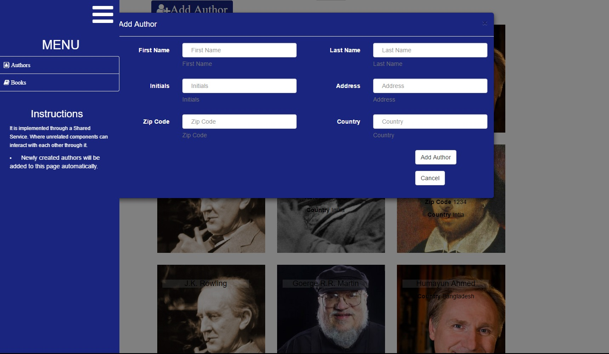
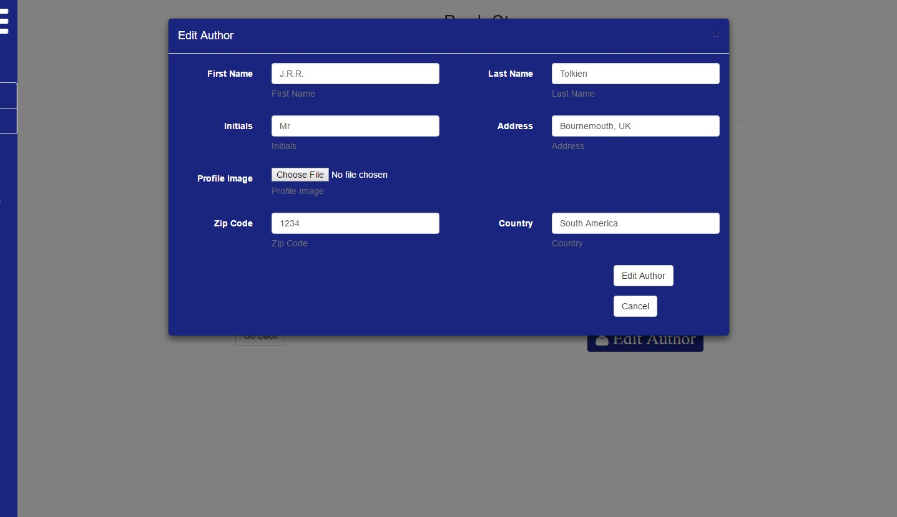
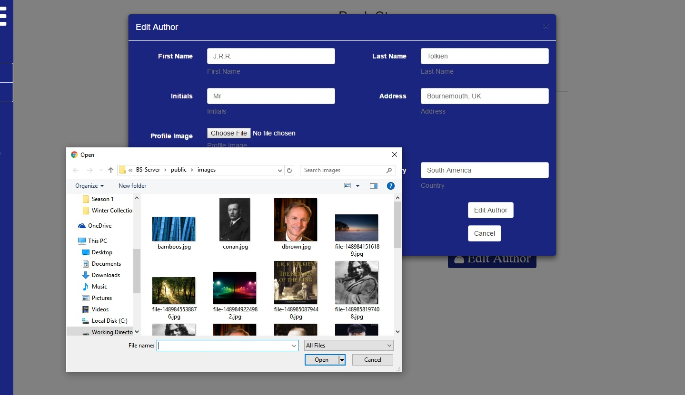
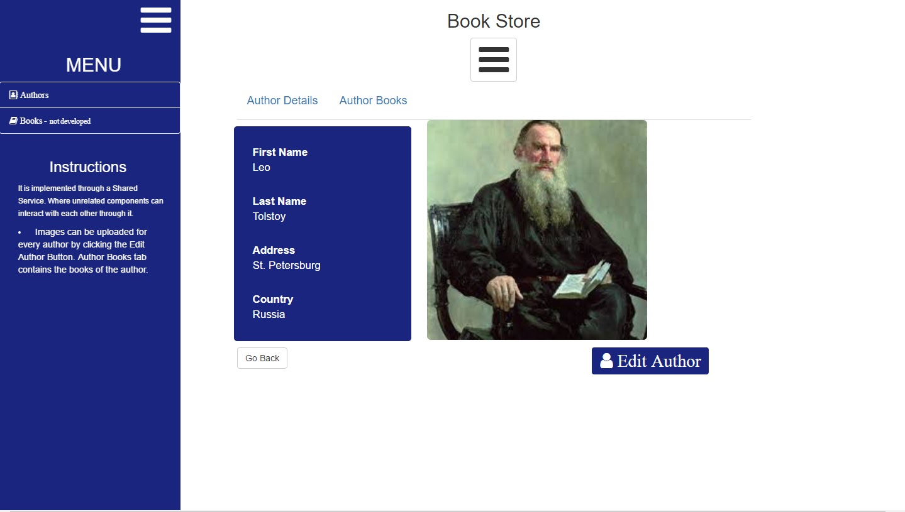
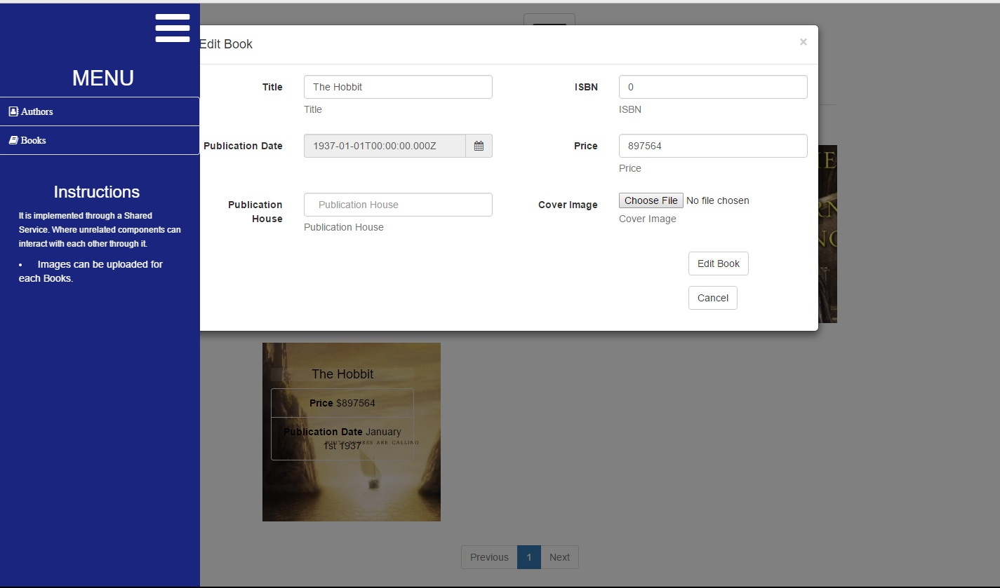
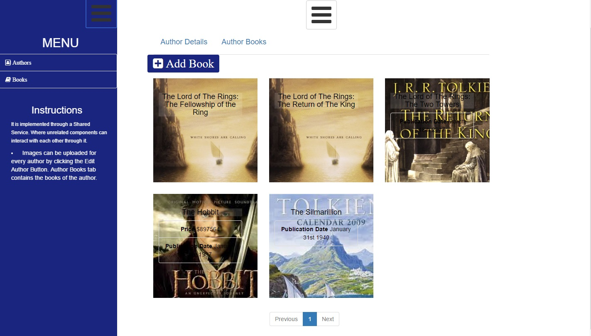
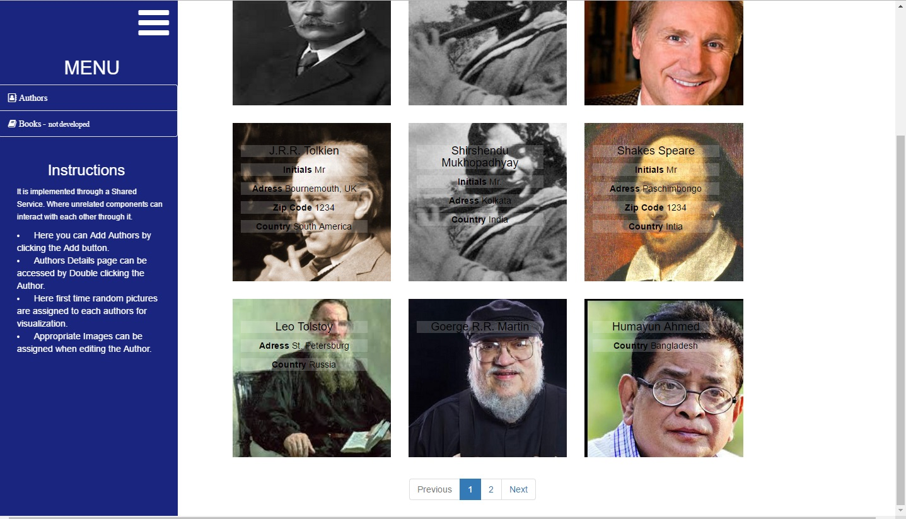
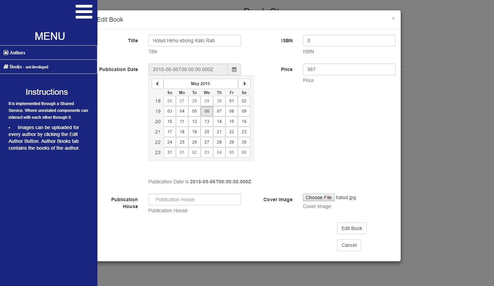
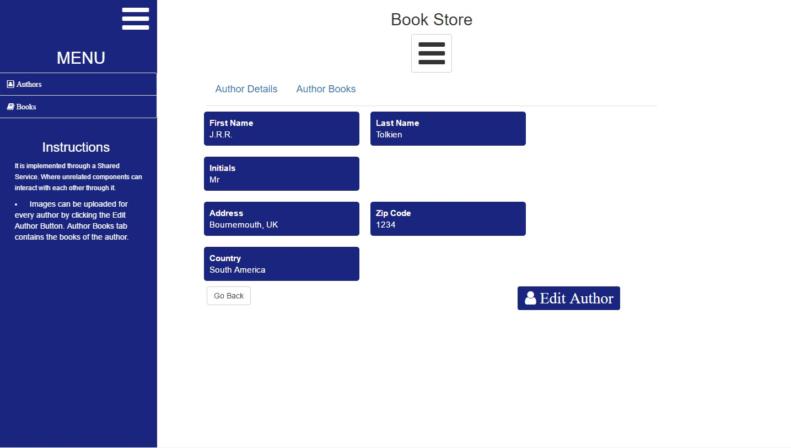

## About

This is a Web App built with the MEAN Stack 2.0.

## Download

1. Download the source code by running the following
```bash
git clone https://github.com/nomanHasan/book-store-mean2-app
```

## Instructions 

### Database Setup

1. Start *mongod.exe*
2. Make sure the Database is running at port 27017.

The Mongo URI set at the server is *mongodb://127.0.0.1:27017/bs_store*

### Server Setup

1. Open BS-Server *cd BS-Server*
2. Install dependencies *npm install*
3. Start the server *npm start*

---
```bash
cd BS-Server
npm install
npm start
```
---

The Server will run at *http://localhost:3000*. ( Assuming *nodemon* is installed )

### Client Setup

1. Open BS-Client *cd BS-Client*
2. Install dependencies *npm install*
3. Deploy the server *npm run deploy*

---
```bash
cd BS-Client
npm install
npm run deploy
```
---

The webpack-dev-server will run at *http://localhost:4200*. And the client server is run with a proxy to the backend by *--proxy-config proxy.conf.json*

#### Now the app can be accessed at *http://localhost:4200*


## Screenshots










