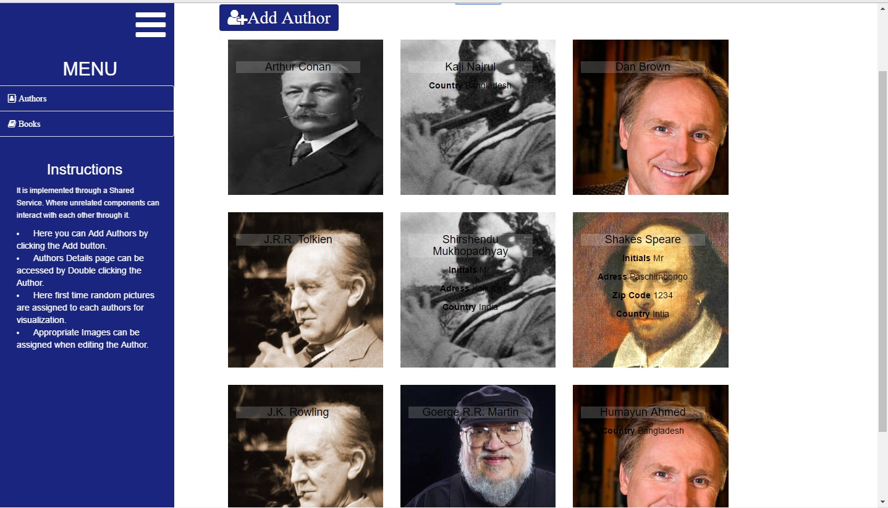

## About

This is a Web App built with the MEAN Stack 2.0.

## Instructions 

### Database Setup

1. Start *mongod.exe*
2. Make sure the Database is running at port 27017.

The Mongo URI set at the server is *mongodb://127.0.0.1:27017/bs_store*

### Server Setup

1. Open BS-Server *cd BS-Server*
2. run *npm install*
3. run *npm start*

The Server will run at *http://localhost:3000*. ( Assuming *nodemon* is installed )

### Client Setup

1. Open BS-Client *cd BS-Client*
2. run *npm install*
3. run *npm start*

The webpack-dev-server will run at *http://localhost:4200*. And the client server is run with a proxy to the backend by *--proxy-config proxy.conf.json*

#### Now the app can be accessed at *http://localhost:4200*

## Screenshots

